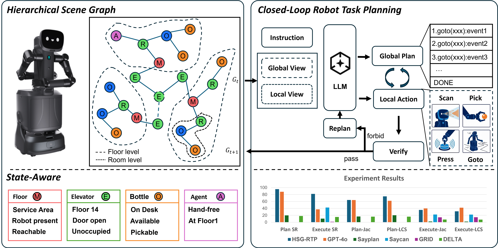

# HSG-RTP

**State-Aware Closed-Loop Robot Task Planning with Hierarchical Scene Graphs**

[中文说明](README_zh-CN.md) · [License](LICENSE)



HSG-RTP is a research codebase for long-horizon robot task planning in multi-room and multi-floor environments. It represents the environment as a Hierarchical Scene Graph (HSG), encodes building-scale and room-scale views separately, and uses a shared Qwen3-8B planner to generate global subtasks and executable local actions. A transactional controller validates every action, commits only consistent state transitions, and invokes structured recovery after failures.

> **Release status.** The repository provides the model, data-generation, training, strict evaluation, closed-loop recovery, ablation, and external-baseline adaptation code. Model weights, generated datasets, experiment outputs, and private credentials are not distributed in the repository. Audited quantitative results are reported below.

## Overview

```text
Instruction + Current HSG
          │
          ├── Global view: room topology + macro-zones
          │        └── global subtask plan
          │
          └── Local view: current room + explicit objects
                   └── next executable action
                              │
                 parse → check → execute → validate
                              │
                   commit state or recover/replan
```

HSG-RTP contains four main components:

- **View-specific HSG encoding:** GATv2-based room-topology encoding for global planning and object-preserving local encoding for action selection.
- **Shared global/local planner:** one frozen Qwen3-8B backbone with trainable LoRA adapters and HSG encoder parameters.
- **Transactional execution:** strict precondition checks and graph updates for `goto`, `scan`, `pick`, `place`, `press`, and `wait`.
- **Closed-loop recovery:** initial-plan repair, one-shot automatic retry for temporary skill failures, local corrective retries, and replacement of the unfinished global plan.

## Repository Structure

```text
HSG-RTP/
├── graph_ir/                       # Canonical graph representation and rewrite rules
├── pipeline/                       # Scene, task, action, and streaming-sample generation
├── utils/                          # HSG encoder, model, and data loaders
├── evaluation/                     # Plan, execution, goal, perturbation, and recovery evaluation
├── scripts/
│   ├── split_task_dataset.py       # Leakage-safe task-level split
│   ├── build_mixed_recovery_dataset.py
│   └── evaluate_recovery_checkpoint.py
├── tests/                          # State, graph, split, policy, and recovery tests
├── configs/                        # DeepSpeed training and inference configurations
├── train_streaming.py              # Main training entry point
├── inference_streaming.py          # Streaming inference entry point
├── evaluate_tasks.py               # Task-level Plan SR / Strict Exec SR evaluation
├── build_data.sh                   # Dataset-generation entry point
└── run_stream.sh                   # Reproducible training/inference launcher
```

The legacy `HLR_dataset/` package and `HLR_*` environment variables remain available for backward compatibility. New integrations should use the HSG-RTP names documented below.

## Installation

The released configuration targets Linux, Python 3.10, CUDA 12.1, and NVIDIA GPUs.

```bash
git clone https://github.com/jansen-liang/HSG-RTP.git
cd HSG-RTP

conda create -n hsg-rtp python=3.10 -y
conda activate hsg-rtp

pip install -r requirements.txt
```

The default backbone is [Qwen3-8B](https://huggingface.co/Qwen/Qwen3-8B). Hugging Face model identifiers can be used directly, or `HSG_RTP_MODEL_PATH` can point to a local copy.

Copy the environment template and configure only the services and paths you use:

```bash
cp .env.example .env
```

```bash
export HSG_RTP_MODEL_PATH=Qwen/Qwen3-8B
export HSG_RTP_TRAIN_DATA=pipeline/output/task_split/train.jsonl
export HSG_RTP_EVAL_DATA=pipeline/output/task_split/test.jsonl
```

API credentials must be supplied through environment variables and must never be committed.

## Data Preparation

### Generate task records

The data pipeline builds scene-conditioned task records, reference action sequences, and streaming global/local training samples:

```bash
./build_data.sh
```

Generated data is written under `pipeline/output/`, which is excluded from version control.

### Create a task-level split

Split task identities before expanding or evaluating streaming samples. This prevents steps from the same task from leaking across training and test sets.

```bash
python scripts/split_task_dataset.py \
  pipeline/output/hsg_rtp_dataset_<timestamp>.json \
  --output-dir pipeline/output/task_split \
  --test-ratio 0.2 \
  --seed 42
```

The command writes `train.jsonl`, `test.jsonl`, and a reproducibility manifest containing task identities, distributions, and source hashes.

### Optional recovery augmentation

Normal streaming samples can be augmented with global-plan repair, temporary-skill retry, and invalid-action correction examples:

```bash
python scripts/build_mixed_recovery_dataset.py \
  --input pipeline/output/task_split/train.jsonl \
  --output pipeline/output/task_split/train_mixed_recovery.jsonl
```

Recovery augmentation is optional; online retry and global-plan replacement are coordinated by the controller at rollout time.

## Training

The main launcher uses Qwen3-8B, rank-16 LoRA, FP16, and DeepSpeed ZeRO-2. Paths can be configured through `HSG_RTP_*` environment variables.

```bash
export HSG_RTP_MODEL_PATH=Qwen/Qwen3-8B
export HSG_RTP_TRAIN_DATA=pipeline/output/task_split/train.jsonl
export HSG_RTP_EVAL_DATA=pipeline/output/task_split/test.jsonl

./run_stream.sh train
```

Reference configuration:

| Setting | Value |
| --- | --- |
| Backbone | Qwen3-8B, frozen |
| LoRA | rank 16, alpha 32, dropout 0.1 |
| LoRA targets | `q_proj`, `k_proj`, `v_proj`, `o_proj` |
| Optimizer | AdamW, learning rate `2e-5` |
| Effective batch size | 16 |
| Epochs | 3 |
| Precision | FP16 |
| Distributed training | DeepSpeed ZeRO-2, 2 GPUs |
| Node / prefix / output limits | 128 / 512 / 448 tokens |

Hardware, paths, and batch settings can be overridden without changing the model definition.

## Inference

Set the trained adapter directory and run streaming inference:

```bash
export HSG_RTP_LORA_CHECKPOINT=checkpoints/<run>/epoch_<n>
./run_stream.sh inference
```

`inference_streaming.py` reads the LoRA rank, alpha, and dropout directly from the checkpoint's `adapter_config.json`, preventing train/inference adapter mismatches.

## Task-Level Evaluation

Calibrate the benchmark by executing reference actions with the strict state manager:

```bash
python evaluate_tasks.py \
  pipeline/output/task_split/test.jsonl \
  --output-dir evaluation_results/oracle
```

To evaluate saved predictions, provide JSONL records containing `task_id`, `global_plan`, and `local_actions`:

```bash
python evaluate_tasks.py \
  pipeline/output/task_split/test.jsonl \
  --predictions evaluation_results/model_predictions.jsonl \
  --output-dir evaluation_results/model
```

The evaluator reports:

- **Plan SR:** valid global-plan syntax, legal room references, reachable topology, correct ordering, and task coverage.
- **Strict Exec SR:** every local action passes its preconditions, every committed state remains valid, and the final symbolic goal is reached.
- **Invalid benchmark tasks:** reference sequences that cannot reach their declared goal are reported separately rather than silently counted as model failures.

## Experimental Results

Results use the corrected held-out benchmark: 70 submitted tasks, of which 66 are supported by the simulator. All rows below use the same bounded controller. The independently trained No-HSG model receives no graph tokens.

| Method | Plan SR (%) | Strict Exec SR (%) | Global Jaccard | Global LCS | Local Jaccard | Local LCS |
| --- | ---: | ---: | ---: | ---: | ---: | ---: |
| Qwen3-8B, zero-shot | 92.42 | 56.06 | 0.624 | 0.733 | 0.128 | 0.117 |
| **HSG-RTP** | **93.94** | **80.30** | **0.634** | **0.739** | **0.354** | **0.312** |
| No-HSG | 86.36 | 77.27 | 0.580 | 0.689 | 0.315 | 0.284 |
| HSG-RTP without global topology | 90.91 | 81.82 | 0.581 | 0.683 | 0.339 | 0.302 |
| HSG-RTP without object tokens | 92.42 | 84.85 | 0.613 | 0.711 | 0.342 | 0.305 |
| HSG-RTP without graph updates/history | 89.39 | 40.91 | 0.614 | 0.714 | 0.101 | 0.091 |

At the individual planning-step level, HSG-RTP obtains 0.7785 Jaccard, 0.7922 LCS ratio, 98.87% global/local mode accuracy, and 0.0722 sample-weighted loss over 1,616 held-out samples.

External methods are reported separately because their native interfaces, controllers, and output protocols are not directly comparable to the table above or to one another.

| Method | Adaptation | Plan SR (%) | Exec SR (%) |
| --- | --- | ---: | ---: |
| SayPlan | Paper reimplementation with Qwen3-8B | 19.70 | 10.61 |
| SayCan | Official-notebook adaptation with symbolic affordances | N/A | 42.42 |
| GRID | Local author code with retrained RN50 | N/A | 1.52 |
| DELTA | Partial upstream adaptation with a fixed problem builder | 18.18 | 15.15 |

The exact protocols and adaptation boundaries are documented in [docs/baseline_protocol.md](docs/baseline_protocol.md). Result summaries can be checked with `python scripts/audit_paper_results.py` when the excluded evaluation artifacts are available locally.

## Closed-Loop Recovery Evaluation

The rollout evaluator supports controlled perturbations such as object relocation, blocked edges, and one-shot skill failures. Recovery traces record initial-plan repair, feedback generation, automatic retry, local retry exhaustion, and global-plan replacement.

```bash
python scripts/evaluate_recovery_checkpoint.py \
  --checkpoint checkpoints/<run>/epoch_<n> \
  --model-path Qwen/Qwen3-8B \
  --dataset pipeline/output/task_split/test.jsonl \
  --baseline-results evaluation_results/recovery_baseline.json \
  --output evaluation_results/recovery_model.json
```

## Testing

Run the lightweight symbolic and data-pipeline tests with:

```bash
python -m unittest discover -s tests -p 'test_*.py'
```

Graph-encoder and model-loading tests require the PyTorch and PyTorch Geometric dependencies from `requirements.txt`.

## Canonical Graph IR

`graph_ir/` provides a typed property graph, schema compilers, deterministic identifiers, relation normalization, validation, and executable graph-rewrite rules.

```bash
python -m graph_ir.cli pipeline/sg/scene_graph.py --scene HOTEL
python -m graph_ir.cli HLR_dataset/data/scene_graphs/hospital_scene_0.json
```

The second command uses the legacy dataset package retained for compatibility.

## Citation

Citation metadata will be added after publication. Please cite the repository URL when using the current research release.

## License

The original code in this repository is released under the [Apache License 2.0](LICENSE). Pretrained models, datasets, simulators, and other third-party components remain subject to their respective licenses.
